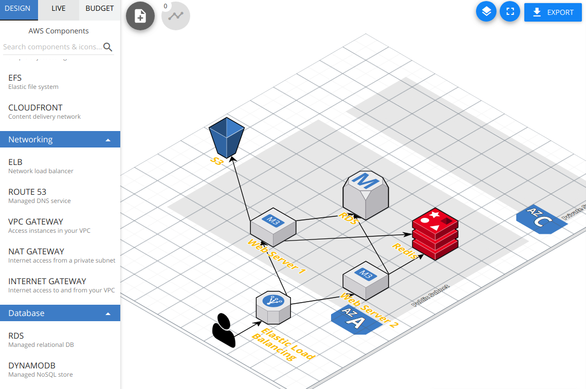
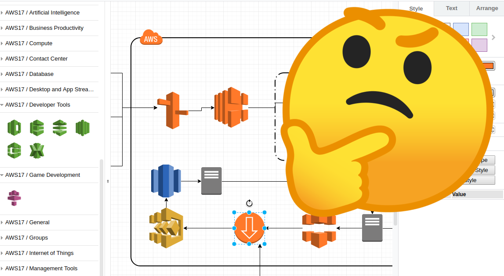

- [CloudCraftとは？](#cloudcraftとは？)
- [CloudCraftの良いところ](#cloudcraftの良いところ)
- [CloudCraftの悪いところ](#cloudcraftの悪いところ)
- [CloudCraftを使うのにオススメな人](#cloudcraftを使うのにオススメな人)

## CloudCraftとは？

[CloudCraft](https://cloudcraft.co/)はAWSの構成図を書くためのツールです。

公式の[AWS アーキテクチャアイコン](https://aws.amazon.com/jp/architecture/icons/)のページにも記載されているツールです。

似たようなツールとしては[draw.io](https://www.draw.io/)や[cacoo](https://cacoo.com/)があります。

基本的には、どのツールも

1. 空のキャンバスを開く
2. SubnetやAZのために枠線を書く
3. AWSサービスのアイコンを、キャンバスに配置する

みたいな感じで書いていくと思いますが、CloudCraftもこんな感じに書いていけます。

例えば、本当にシンプルな構成だとしたらこんな感じです。



## CloudCraftの良いところ
### マス目にオブジェクトを配置していくので、書きやすい
他のツールだとプレゼンを作るのと似た感じでオブジェクトを配置していくのですが、これが慣れてないと本当に難しい。

「枠線が小さかったから大きくしよう。じゃあ枠の上にあるアイコンのサイズも大きくしよう、あぁなぜかアイコンな大きすぎる。そしてなぜか関係無いはずの矢印線に折れ目がついた...（絶望）」

CloudCraftはデザインに関する自由度が低く、そのおかげか直感的に配置してもデザインが崩れないように思います。

### AWSサービスのアイコンと名前を覚えて無くても使いやすい
アイコンとサービス名が紐づいてないと、アイコン **だけ** を配置していくのって、出来ないですよね。



```
モニタの左側: AWS構成図の作成ツール
モニタの右側: アイコンとサービスの対象表
```

僕はこうでもやらないと出来ない気がします。多分、モニタ１台じゃ無理ですね！ :innocent:

CloudCraftだと、アイコンに紐づく形でテキストを入力できるのでアイコンと名称が一致して無くても大丈夫です。
テキストに「RDS」とか書けば済むので。

またアイコンを移動させたら、そのテキストも移動するというのも、地味に嬉しい機能です。

### free-trialでない
僕の場合だと、お試しで使い始めたので、これはありがたかったです。

## CloudCraftの悪いところ
### 無料プランだとキャンバスサイスが小さい
じゃあと思って[料金](https://cloudcraft.co/pricing)を見ると...


たっか！！！

正直、個人開発では手が出ない価格ですね…

（まぁAWS構成図ツールはどこも高いのですが）

## CloudCraftを使うのにオススメな人
以上の良し悪しをまとめると

- プレゼンとかで、オブジェクトの配置が面倒に感じる人
- AWSサービスのアイコンと名称を覚えられない人
- キャンバスサイズが小さくても何とかなるほどに、AWSの利用するサービスが少ない人

みたいな人はCloudCraftを使うのにオススメです。

私見ですが、AWS初学者が構成をまとめるのに向いてるかも？

是非、良し悪しを見極めて上手く使いこなしてもらえればと思います。