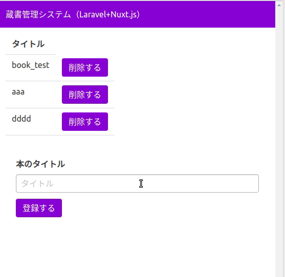
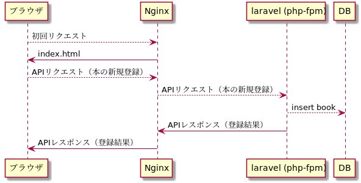
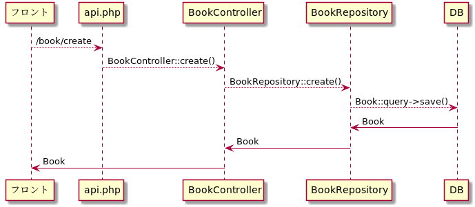
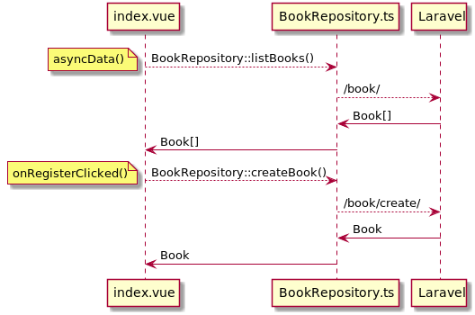
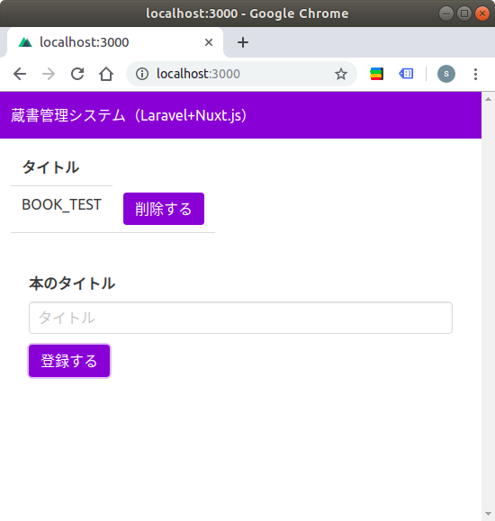

0. [はじめに](#はじめに)
0. [システムアーキテクチャ](#システムアーキテクチャ)
0. [Laravel/Nuxt.jsインストール](#laravelnuxtjsインストール)
3. [Docker環境構築](#docker環境構築)
4. [Nginx設定](#nginx設定)
5. [Typescript対応](#typescript対応)
7. [サーバーでのモデル/ビジネスロジック実装](#サーバーでのモデルビジネスロジック実装)
8. [フロントでのモデル/ビジネスロジック実装](#フロントでのモデルビジネスロジック実装)
9. [Heroku設定](#heroku設定)

## はじめに

※本記事は [qiitaのにあげた記事](https://qiita.com/kon_shou/items/8af16956325a447a2d64) と同様になります。

本記事では「フレームワークをインストールして、それをインターネットに公開する」という0から1までのフェーズについて、Laravel+Nuxt.jsによって「蔵書管理」システムを構築して解説したいと思います。

また、実際に構築したシステムは下記になります。
- Heroku: https://frozen-castle-47874.herokuapp.com/
- Github: https://github.com/kon-shou/bcm-qiita-example



## システムアーキテクチャ

下記の技術スタックを用います。

サーバーサイド: Laravel 5.8
フロントサイド: Nuxt.js 2.8.1 (SPA)
Webサーバー: Nginx
開発環境構築: docker
デプロイ: Heroku


また処理フローの図は下記になります。



「ブラウザにNuxt.jsで生成したSPAを返し、そのSPAからAPIサーバーであるLaravelにAPIリクエストを、Nginxを介して行う」というフローです。

## Laravel/Nuxt.jsインストール

まずは[Laravelドキュメント](https://readouble.com/laravel/5.8/ja/installation.html)に従って Laravelでプロジェクトを作成します。

```bash
composer create-project --prefer-dist laravel/laravel book-collection-management
```

作成したLaravelプロジェクトに `client` というディレクトリを新設して、そこに[Nuxt.jsドキュメント](https://ja.nuxtjs.org/guide/installation)に従って Nuxt.jsをインストールします。

```bash
yarn create nuxt-app client ./client
```

コマンド実行後の選択肢は各自の要望に応じて設定してください。
自分の場合、下記のように設定しました。

```bash
? Project name client
? Project description My fantastic Nuxt.js project
? Author name kon-shou
? Choose the package manager Yarn
? Choose UI framework Buefy
? Choose custom server framework None (Recommended)
? Choose Nuxt.js modules Axios
? Choose linting tools ESLint, Prettier
? Choose test framework None
? Choose rendering mode Single Page App
```

コマンドによって `./client` にNuxt.jsがインストールされましたが、このままだとプロジェクトの二重管理になるため、下記を行います。

- `./client/node_module` を削除
  - `rm -rdf ./client/node_modules`
- `./client` の git 管理を解除
  - `rm -rdf ./client/.git/`
- `./client` にある各種設定ファイルを laravel のルートに移動＆更新

設定ファイルの更新は各自の環境に合わせて行ってください。
ただ下記の２つのファイルは特に重要なので、注記します。

- `.package.json`
  - npm scripts に nuxt コマンドを追記
  - nuxt に必要なライブラリを追加
  - [修正後の.package.json](https://github.com/kon-shou/bcm-qiita-example/blob/b1e3953962f917b659891a1f63f0d6d94f392a55/package.json)
- `nuxt.config.js`
  - `srcDir: 'client/'` を追記
  - nuxt build によって生成される `index.html` の出力先を `public/dist` に変更
  - [修正後のnuxt.config.js](https://github.com/kon-shou/bcm-qiita-example/blob/b1e3953962f917b659891a1f63f0d6d94f392a55/nuxt.config.js)

`index.html` の出力先の変更は、ドキュメントルートである `public` 以下に配置することを意図しています。
詳細は「Nginx設定」で解説します。

その `index.html` の出力先の変更は https://github.com/nuxt/nuxt.js/issues/3217 に従って

```javascript:title=nuxt.config.js
  generate: {
    dir: 'public/dist'
  }
```

を追記することで出力先を変更することができます。

以上を実行した後のディレクトリ構造は下記になります。

```bash
(root)
├── .editorconfig
├── .env
├── .env.example
├── .eslintrc.js
├── .git
├── .gitattributes
├── .gitignore
├── .idea
├── .prettierrc
├── .styleci.yml
├── app
├── artisan
├── bootstrap
├── client
│   ├── README.md
│   ├── assets
│   ├── components
│   ├── layouts
│   ├── middleware
│   ├── pages
│   ├── plugins
│   ├── static
│   └── store
├── composer.json
├── composer.lock
├── config
├── database
├── node_modules
├── nuxt.config.js
├── package.json
├── phpunit.xml
├── public
├── readme.md
├── resources
├── routes
├── server.php
├── storage
├── tests
├── vendor
├── webpack.mix.js
└── yarn.lock
```

## Docker環境構築
次は、DockerでWebサーバーとDBを構築して `docker-compose up -d` でアプリが立ち上がるようにします。
追加するファイルは下記になります。

```bash
(root)
├── Dockerfile              => docker-compose.yml の app.build.dockerfile で参照される
├── docker
│   ├── entrypoint-app.sh   => docker-compose.yml の app.command で参照される
│   ├── nginx.conf          => docker-compose.yml の app.volumes で参照される
│   └── php-fpm.conf        => docker-compose.yml の app.volumes で参照される
├── docker-compose.yml
└── scripts
    └── provisioning.sh     => docker-compose.yml の app.command で参照される
```

docker-compose.ymlは下記になります。

```yml:title=docker-compose.yml
version: '3'

services:
  mysql:
    image: mysql:5.7
    volumes: # host/docker間で共有するデータを指定
      - "${HOME}/book-management_mysql:/var/lib/mysql"
    environment:
      MYSQL_ALLOW_EMPTY_PASSWORD: 1
      TZ: "Asia/Tokyo"
    ports:
      - "3306:3306"
  app:
    build: . # Dockerfileのディレクトリを指定
    user: ubuntu
    volumes: # host/docker間で共有するデータを指定
      - .:/srv
      - ./docker/nginx.conf:/etc/nginx/sites-enabled/bcm
      - ./docker/php-fpm.conf:/etc/php/7.2/fpm/pool.d/bcm.conf
    command: docker/entrypoint-app.sh # 起動処理を設定
    depends_on:
      - mysql
    links:
      - mysql
    ports:
      - "8000:8000"
    working_dir: /srv
```
`docker-compose up -d` の処理の順番は下記になります。

1. mysqlコンテナの起動
1. appコンテナの起動
  1. `Dockerfile` ( `provisioning.sh` ) からdocker imageの作成
  2. `nginx.conf` / `php-fpm.conf` のマウント
  3. `entrypoint-app.sh` の nginx / php-fpm の起動
  
各ステップについて解説します。

#### 1. mysqlコンテナの起動

mysqlコンテナは、mysql5.7のイメージを元にして、パスワード省略及びタイムゾーンを東京にして、ホスト/dockerの3306番ポートでアクセスを可能にしています。

ホストからmysqlコンテナへのアクセスは `mysql -h 127.0.0.01 -uroot` で行えます。
またappコンテナからmysqlへのアクセスは `docker-compose exec app bash` でappコンテナに入り `mysql -h mysql -uroot` で行えます。

#### 2. appコンテナの起動

appコンテナは、Dockerfileで必要なライブラリをインストールしたイメージを準備し、`/srv` にプロジェクトディレクトリをマウントし、ホスト/dockerの8000番ポートでアクセスを可能にしています。

#### 2.1 `Dockerfile` ( `provisioning.sh` ) からdocker imageの作成

Dockerfileは下記になります。

```Dockerfile:title=Dockerfile
FROM ubuntu:18.04

COPY scripts/provisioning.sh /tmp/provisioning.sh
# provisioning.sh による必要ライブラリのインストール
RUN /tmp/provisioning.sh

# nginxの初期設定を削除
RUN rm /etc/nginx/sites-enabled/default
# php-fpmの初期設定を削除
RUN rm /etc/php/7.2/fpm/pool.d/www.conf

# ubuntuユーザーを追加
RUN useradd -m -s /bin/bash -u 1000 -g users ubuntu

RUN apt install sudo
# ubuntuでのsudoのパスワード要求をしないように
RUN echo "ubuntu ALL=(ALL:ALL) NOPASSWD:ALL" >> /etc/sudoers
RUN chown ubuntu:users /srv
```

Dockerfileにて `provisioning.sh` によってライブラリをインストールし、その後にユーザー関連の設定を行います。
`provisioning.sh` は下記になります。

```bash:title=provisioning.sh
#!/usr/bin/env bash

function package_install() {
  env DEBIAN_FRONTEND=noninteractive apt install -y $1
}

apt-get update -y

package_install php-fpm
package_install php-mysql
package_install php-imagick
package_install php-gd
package_install php-curl
package_install php-mbstring
package_install php-bcmath
package_install php-xml
package_install php-zip
package_install php-redis
package_install php-intl
package_install nginx
package_install composer

package_install mysql-client

package_install zip
package_install unzip
package_install jq
package_install git
package_install jq
package_install vim
package_install curl
```

もし、appコンテナで追加のライブラリが必要になったら、この `provisioning.sh` に追記し、改めてイメージをビルドするのが良いかと思います。

#### 2.2 `nginx.conf` / `php-fpm.conf` のマウント

この２つの設定ファイルを配置することで、nginx/php-fpmが正しく起動できるようになります。

`php-fpm.conf` は下記になります。

```conf:title=php-fpm.conf
[bcm]
user = ubuntu
group = users

listen = /run/php/bcm.sock

listen.owner = www-data
listen.group = www-data

pm = dynamic
pm.start_servers = 1
pm.max_children = 4
pm.min_spare_servers = 1
pm.max_spare_servers = 2

request_terminate_timeout = 300

chdir = /srv
```

`php-fpm.conf` については [公式のマニュアル](https://www.php.net/manual/ja/install.fpm.configuration.php) でオプションを逐一調べていくのが早いかと思います。

またソケットがどういうものか理解するのかは https://qiita.com/kuni-nakaji/items/d11219e4ad7c74ece748 の記事が非常に分かりやすく、参考にさせていただきました。

`nginx.conf` の詳細については次の「Nginx設定」にて解説します。

#### 2.3 `entrypoint-app.sh` の nginx / php-fpm の起動

`entrypoint-app.sh` は下記になります。

```bash:title=entrypoint-app.sh
#!/bin/bash

sudo service php7.2-fpm start
sudo service nginx start

tail -f /dev/null
```

内容としては、php-fpm/nginxの起動と、dockerが落ちないようにする処理です。

これをdocker起動処理として行うことで `docker-compose up -d` だけでphp-fpm/nginxの起動をさせることができます。

なお `tail -f /dev/null` の詳細については http://kimh.github.io/blog/jp/docker/gothas-in-writing-dockerfile-jp/#hack_to_run_container_in_the_background のブログ記事が非常にわかりやすく、参考にさせていただきました。

## Nginx設定
Laravel/Nuxt.jsのインストールによって、初回アクセス時にブラウザに返却される `index.html` と、その `index.html` からのAPIアクセスを受ける `index.php` を準備できるようになりました。

そこで、下記の前提条件を元にして、Nginxの設定を行いたいと思います。

- ドキュメントルートは `/public` とする
- `nuxt build` によって生成される `index.html` 、及びその `index.html` から呼ばれる js ファイルは `public/dist/` 以下に配置する
- ブラウザに返された `index.html` からのAPIリクエストは `public/index.php` にルーティングする

この前提条件を満たす `nginx.conf` は下記になります。

```nginx:title=nginx.conf
server {
    # Nginxが待ちうけるポートを指定
    listen 8000 default_server;

    # ドキュメントルートを指定
    root /srv/public;

    # {URL}/ の場合に {URL}/index.html を返す
    # index index.html (デフォルト)

    # /{任意の文字列} に前方一致するURLの場合に
    # 1. /srv/public/{任意の文字列} に一致するファイルが存在すればそれを返し、存在しなければ
    # 2. /dist/index.html?$query_string にリダイレクトする
    location / {
        try_files $uri /dist/index.html?$query_string;
    }

    # {任意の文字列1}/_nuxt/{任意の文字列2}に一致するURLの場合に
    # 1. /srv/public/{任意の文字列1}/_nuxt/{任意の文字列2} に一致するファイルが存在すればそれを返し、存在しなければ
    # 2. /dist/_nuxt/{任意の文字列2} にリダイレクトする
    location ~ /(_nuxt)/(.+)$ {
        try_files $uri /dist/$1/$2;
    }

    # {任意の文字列1}/api/{任意の文字列2}に一致するURLの場合に
    # 1. /srv/public/{任意の文字列1}/api/{任意の文字列2} に一致するファイルが存在すればそれを返し、存在しなければ
    # 2. /index.php?$query_string にリダイレクトする
    location ~ /api/ {
        try_files $uri /index.php?$query_string;
    }

    # {任意の文字列}.phpに一致するURLの場合に
    # 1. /srv/public/{任意の文字列}.php　に一致するファイルが存在すれば、そのリクエストをFastCGIに渡し、存在しなければ404を返す
    # 2. /index.php?$query_string にリダイレクトする
    location ~ \.php$ {
        try_files $uri =404;
        fastcgi_split_path_info ^(.+\.php)(/.+)$;
        fastcgi_pass unix:/run/php/bcm.sock;
        fastcgi_index index.php;
        include fastcgi_params;
        fastcgi_param SCRIPT_FILENAME $document_root$fastcgi_script_name;
    }
}
```

実際のアクセスでどういう処理になるかは下記になります。

| 順番 | どういうアクセスか                                                             | Nginxはどういう処理をするか                                                                                 |
|------|--------------------------------------------------------------------------------|-------------------------------------------------------------------------------------------------------------|
| 1    | 初回アクセス                                                                   | URLが `/` に一致するため `srv/public/dist/index.html` をブラウザに返却する                                  |
| 2    | `index.html` の `<script>` タグに記述された `_nuxt/xxxx.js` を取得するアクセス | URLが `/(_nuxt)/(.+)$` に一致するため `srv/public/dist/_nuxt/xxxx.js` をブラウザに返却する                  |
| 3    | index.htmlからの `/api/xxx` というAPIアクセス                                  | URLが `/api/` に一致するため `srv/public/index.php` を経て、Laravelで実装したレスポンスをブラウザに返却する |

この nginx.conf でルーティングがどうなるか読み解く鍵は下記かと思います。

- locationの前方一致と正規表現の優先順位の違い
- try_files の挙動

https://heartbeats.jp/hbblog/2012/04/nginx05.html の記事が非常に分かりやすく、参考にさせていただきました。

## Typescript対応
必ずしも必要ではありませんが、Nuxt.jsの場合ではTypescriptの導入が容易であるため、ついでに導入します。

[公式の導入手順](https://ja.nuxtjs.org/guide/typescript/) に従っていけば導入できます。

- 必要ライブラリのインストール

```bash
yarn add -D @nuxt/typescript @typescript-eslint/eslint-plugin @typescript-eslint/parser
yarn add ts-node vue-class-component vue-property-decorator
touch tsconfig.json
```

- `nuxt.config.js` の修正
  - `NuxtConfiguration` を追記
  - `nuxt.config.js` へリネーム
  - [修正後のnuxt.config.ts](https://github.com/kon-shou/bcm-qiita-example/blob/48707dea0741f7e479650f1dd914061f9e628338/nuxt.config.ts)

- `npm run dev` 後に `tsconfig.json` の修正
  - `"exclude": ["node_modules", "vendor"]` を追記
  - `"baseUrl": "./client"` と修正
  - [修正後のtsconfig.json](https://github.com/kon-shou/bcm-qiita-example/blob/48707dea0741f7e479650f1dd914061f9e628338/tsconfig.json)

- lint対応
  - `parser` / `plugins` の修正
  - [修正後の.eslintrc.js](https://github.com/kon-shou/bcm-qiita-example/blob/48707dea0741f7e479650f1dd914061f9e628338/.eslintrc.js)

- `.vue` ファイルをTypescript対応
  - [修正後のindex.vue](https://github.com/kon-shou/bcm-qiita-example/blob/48707dea0741f7e479650f1dd914061f9e628338/client/pages/index.vue) ( `フロントでのモデル/ビジネスロジック実装` で新規でpage/componentを作るのでここでの修正は必要ありませんが、参考までに)

以上を実行すれば、Typescript でフロントを実装できると思います。

## サーバーでのモデル/ビジネスロジック実装

サーバで実装するのは下記の５つになります。

- Bookモデル
- migrationファイル
- Bookレポジトリ
- Bookコントローラ
- ルーティング

```bash
(root)
├── app
│   ├── Eloquent
│   │   └── Book.php    => Bookモデル
│   ├── Http
│   │   ├── Controllers
│   │   │   └── BookController.php  => Bookコントローラ
│   └── Repository
│       └── BookRepository.php      => Bookレポジトリ
├── database
│   └── migrations
│       └── 2019_06_12_150818_create_books_table.php    => migrationファイル
└── routes
   └── api.php  => ルーティング
```

また、本の登録のAPIリクエストがフロントから来た場合の、フローは下記になります。


それぞれについて解説します。

### Bookモデル

```php:title=Book.php
<?php

namespace App\Eloquent;

use Illuminate\Database\Eloquent\Model;

/**
 * Class Book
 * @package App\Eloquent
 *
 * @property int $id
 * @property int $title
 */
class Book extends Model
{
}
```

本には「ID」と「タイトル」のみ存在するものとして、Bookモデルを定義します。
今回の場合、最低限の記述で良いかと思います

### migrationファイル

```php:title=database/migrations/2019_06_12_150818_create_books_table.php
<?php

use Illuminate\Support\Facades\Schema;
use Illuminate\Database\Schema\Blueprint;
use Illuminate\Database\Migrations\Migration;

class CreateBooksTable extends Migration
{
    /**
     * Run the migrations.
     *
     * @return void
     */
    public function up()
    {
        Schema::create('books', function (Blueprint $table) {
            $table->bigIncrements('id');
            $table->string('title');
            $table->timestamps();
        });
    }

    /**
     * Reverse the migrations.
     *
     * @return void
     */
    public function down()
    {
        Schema::dropIfExists('books');
    }
}
```

BookモデルはActiveRecordであるため、モデルのプロパティと同様のカラムを持たせています。

### Bookレポジトリ

```php:title=BookRepository.php
<?php

namespace App\Repository;

use App\Eloquent\Book;
use Illuminate\Support\Collection;

class BookRepository
{
    public function find(int $id): ?Book
    {
        return Book::query()->find($id);
    }

    public function list(): Collection
    {
        return Book::query()->get();
    }

    public function create(string $title): Book
    {
        $book = new Book();
        $book->title = $title;

        $book->save();

        return $book;
    }

    public function delete(Book $book)
    {
        return Book::query()->find($book->id)->delete();
    }
}
```

コントローラで直接にデータを更新するのでなく、レポジトリでデータの更新を行い、コントローラはレポジトリのメソッドを呼び出すようにします。

このようにすることで「データが持たせ方が変わった場合（例: Bookの格納をRDSでなくNoSQLに変更する）に、修正範囲を限定させることが出来る」等々のメリットがあります。


### Bookコントローラ

```php:title=BookController.php
<?php

namespace App\Http\Controllers;

use App\Repository\BookRepository;
use Dotenv\Exception\ValidationException;
use Illuminate\Http\Request;

class BookController extends Controller
{
    private $bookRepository;

    public function __construct(BookRepository $bookRepository)
    {
        $this->bookRepository = $bookRepository;
    }

    public function list()
    {
        return $this->bookRepository->list();
    }

    public function create(Request $request)
    {
        $title = $request->get('title');
        if (!$title) {
            throw new ValidationException('titleは必須です');
        }

        return $this->bookRepository->create($title);
    }

    public function delete(int $id)
    {
        $book = $this->bookRepository->find($id);
        if (!$book) {
            throw new ValidationException('削除対象のbookが存在しません');
        }

        $this->bookRepository->delete($book);

        return [];
    }
}
```

コントローラでは、基本的にレポジトリのメソッドを呼び出すことで、Bookモデルの取得/登録/削除を行います。

また、BookRepositoryはコンストラクタでDIを行うことで、コントローラとレポジトリの依存関係を薄くしています。
こうすることで「ユニットテストでは、特別に用意したBookRepositoryを呼び出すことができ、ユニットテストの書きやすさが向上する」等々のメリットが有ります。

### ルーティング

```php:title=api.php
<?php

use Illuminate\Http\Request;

Route::group(['prefix' => 'book'], function ($route) {
    $route->get('/', 'BookController@list');
    $route->post('/create', 'BookController@create');
    $route->delete('/delete/{id}', 'BookController@delete');
});
```

本の取得/登録/削除の３つのエンドポイントを用意し、それぞれからコントローラの対応するメソッドを呼びます。

### 確認

実際にAPIリクエストによってDBが更新されるか確認するためには以下の手順を踏みます。

1. `.env` の更新
2. MySQL に database を追加
3. migration実行

今回の場合だと mysqlコンテナの設定に合わせて、下記のように `.env` を更新します。

```env:title=.env
DB_CONNECTION=mysql
DB_HOST=mysql
DB_PORT=3306
DB_DATABASE=laravel
DB_USERNAME=root
DB_PASSWORD=
```

`.env` を更新した後に `php artisan config:cache` としてやることで `.env` の変更を反映させます。

その後、appコンテナから mysqlに接続 ( `docker-compose exec app mysql -h mysql -uroot` ) し 

```sql
create database laravel;
``` 

とすることで laravel データベースを作成します。

そして `php artisan migrate` と実行することで、migrationが実行できるかと思います。

以上の準備をしたあとで、

```bash
curl http://localhost:8000/api/book/create -X POST -H "Content-Type: application/json" -d '{"title":"book_test"}'
```

と叩くことで、更新が行われ、そのレスポンスが帰ってくることが確認できるかと思います。

## フロントでのモデル/ビジネスロジック実装

フロントでは下記の6つを実装します。

- Bookモデル
- Bookレポジトリ
- plugins/dependency.ts
- index.d.ts
- Axios の proxy
- index.vue

```bash
(root)
├── client
│   ├── domain
│   │   └── Book
│   │       ├── Book.ts
│   │       └── BookRepository.ts
│   ├── pages
│   │   ├── index.vue
│   ├── plugins
│   │   └── dependency.ts
│   └── static
├── index.d.ts
└── nuxt.config.js
```

フロントにおけるBook取得/登録のフローは下記です。



なおフロントにレポジトリ層を持たせる設計については、拙作ではありますが [こちらのスライド](https://speakerdeck.com/kon_shou/shi-yun-yong-niokerularaveltonuxtdefalserepositoryfalsereiyafen-ge-falsehua) にて詳細を解説していますので、ご参考ください。

### Bookモデル

```typescript:title=Book.ts
import _ from 'lodash'

export default class Book {
  constructor(protected properties: { [key: string]: any }) {}

  get id(): string {
    return _.get(this.properties, 'id')
  }

  get title(): string {
    return _.get(this.properties, 'title')
  }
}
```

サーバーと同様のBookモデルを定義します。
これによって `new Book({id: xxx, titile: yyy})` という形式でモデルを作ることができ、このモデルで型宣言を行うことができるようになります。

### Bookレポジトリ
```typescript:title=BookRepository.ts
import _ from 'lodash'
import { AxiosInstance } from 'axios'
import Book from '~/domain/Book/Book'

export default class BookRepository {
  private axios: AxiosInstance

  constructor(axios: AxiosInstance) {
    this.axios = axios
  }

  public async listBooks(): Promise<Book[]> {
    const response = await this.axios.get('/book/')
    return _.map(response.data, bookData => new Book(bookData))
  }

  public async createBook(title: string): Promise<Book> {
    const response = await this.axios.post('/book/create', {
      title: title
    })
    return new Book(response.data)
  }

  public async deleteBook(book: Book) {
    await this.axios.delete(`/book/delete/${book.id}`)
  }
}
```

こちらもサーバーと同様にBookRepositoryを実装します。
メリットについてもサーバーと同様です。

コンストラクタで axiso を注入をしていますが、これは後述する `plugins/dependency.ts` にて注入を行っています。
注入によって axios の context を維持しつつAPIリクエストを投げられるようになります。

### plugins/dependency.ts

```typescript:title=dependency.ts
import BookRepository from '~/domain/Book/BookRepository'

export default (context, inject) => {
  const bookRepository = new BookRepository(context.$axios)

  inject('bookRepository', bookRepository)
}
```

BookRepositoryに `context.$axios` を渡し、生成された `bookRepository` を `$bookRepository` として Vue インスタンス内で呼び出せるように登録しています。

このプラグインを `nuxt.config.ts` にて呼び出します。

```typescript:title=nuxt.config.ts
  plugins: ['~/plugins/dependency'],
```

なお、NuxtにおけるInjectionについては[公式ドキュメント](https://ja.nuxtjs.org/guide/plugins/) と https://tech.cydas.com/entry/nuxt-inject の記事が非常にわかりやすく、参考にさせていただきました。

### index.d.ts

`dependency.ts` にて `$bookRepository` を登録しましたが、このままだと Typescript のチェックでエラーが出るので型定義ファイルに `$bookRepository` に追加します。

```typescript:title=index.d.ts
import BookRepository from '~/domain/Book/BookRepository'

declare module 'vue/types/vue' {
  interface Vue {
    $bookRepository: BookRepository
  }
}
```

### Axios の proxy

BookRepository にて axios を利用していますが、このままだと 例えば本の登録では、Nginxがリッスンしている `http://localhost:8000/api/book/create` でなく`http://localhost:3000/book/create` に対してリクエストをしてしまうので、下記の修正を行います。

- axios.baseURL の指定

下記を追記することで、urlのプレフィックスとして `/api` を付与します。

```typescript:title=nuxt.config.ts
  axios: {
    baseURL: '/api'
  },
```

- `@nuxtjs/proxy` の利用

nuxt の [proxy-module](https://github.com/nuxt-community/proxy-module) を利用して、axiosからのリクエストを proxy します。

今回の場合は `.env` にAPIサーバーのURLを追記して、それを `nuxt.config.ts` に呼び出すことにします。

まず `.env` に下記を追加して

```env:title=.env
API_BASE_URL=http://localhost:8000/api
```

次に `nuxt.config.ts` を修正します。

```typescript:title=nuxt.config.ts
import NuxtConfiguration from '@nuxt/config'

require('dotenv').config()

const config: NuxtConfiguration = {
...
  modules: [
    // Doc: https://buefy.github.io/#/documentation
    'nuxt-buefy',
    // Doc: https://axios.nuxtjs.org/usage
    '@nuxtjs/axios',
    '@nuxtjs/eslint-module',
    '@nuxtjs/proxy'
  ],
...
}

if (process.env.API_BASE_URL) {
  config.proxy = [process.env.API_BASE_URL]
}

export default config
```

これによって axios のリクエストが `http://localhost:8000/api` に行われるようになります。

### index.vue

最後に index.vue の修正を行います。

index.vue では主に下記の3つの処理を行います。

- asynData() で `$bookRepository.listBooks()` を実行し、本の一覧を取得
- 登録ボタンクリックで `$bookRepository.createBook(this.title)` を実行し、本を登録し、その後に一覧を再取得
- 削除ボタンクリックで `$bookRepository.deleteBook(book)` を実行し、本を削除し、その後に一覧を再取得

```vue:title=index.vue
<template>
  <section>
    <table class="table">
      <tr>
        <th>ID</th>
        <th>タイトル</th>
      </tr>
      <tr v-for="book in books" :key="book.id">
        <td>{{ book.id }}</td>
        <td>{{ book.title }}</td>
        <td>
          <button
            type="button"
            class="button is-primary"
            @click.prevent="deleteBook(book)"
          >
            削除する
          </button>
        </td>
      </tr>
    </table>

    <section class="modal-card-body">
      <b-field label="本のタイトル">
        <b-input v-model="title" type="input" placeholder="タイトル" />
      </b-field>
      <button
        type="button"
        class="button is-primary"
        @click.prevent="createBook()"
      >
        登録する
      </button>
    </section>

    <p v-if="error">{{ error }}</p>
  </section>
</template>

<script lang="ts">
import { Component, Vue } from 'vue-property-decorator'
import Book from '~/domain/Book/Book'

@Component({
  async asyncData({ app }) {
    const books = await app.$bookRepository.listBooks()

    return {
      books
    }
  }
})
export default class extends Vue {
  private books

  private title = ''
  private error = ''

  async createBook() {
    try {
      await this.$bookRepository.createBook(this.title)

      this.books = await this.$bookRepository.listBooks()
      this.title = ''
    } catch (e) {
      this.error = e
    }
  }

  async deleteBook(book: Book) {
    try {
      await this.$bookRepository.deleteBook(book)

      this.books = await this.$bookRepository.listBooks()
    } catch (e) {
      this.error = e
    }
  }
}
</script>
```

### 確認

以上のフロント/サーバーでの実装が完了した後に

- docker-compose up -d
- npm run dev

を実行すれば、 `http://localhost:3000/` にてシステムが動作してることが確認できるかと思います。



## Heroku設定

herokuの設定としては、下記の５つを実装します

- `infra/nginx/nginx.conf` / `Procfile` の追加
- heroku buildpack の追加
- Clear DB の設定
- `app/Providers/AppServiceProvider.php` の修正
- 環境変数の設定

```bash
(root)
├── Procfile
├── app
│   └── Providers
│       └── AppServiceProvider.php
└── infra
    └── heroku
        └── nginx.conf
```

なお `heroku create` によるherokuとの連携は完了してる前提です。

### `infra/nginx/nginx.conf` / `Procfile` の追加

herokuで Nginx を使うために `infra/nginx/nginx.conf` を [herokuの公式ドキュメント](https://devcenter.heroku.com/articles/custom-php-settings#using-a-custom-application-level-nginx-configuration) に従って、新しく作成します。

- location ディレクティブのみを使う
- `fastcgi_pass` は `heroku-fcgi` を指定する

という点を反映させると、下記のようになると思います。

```nginx:title=nginx.conf
location / {
    try_files $uri /public/dist/index.html?$query_string;
}

location ~ /_nuxt/(.+)$ {
    try_files $uri /public/dist/_nuxt/$1;
}

location ~ /api/ {
    try_files $uri /public/index.php?$query_string;
}

location ~ \.php$ {
    try_files $uri /public/index.php =404;
    fastcgi_split_path_info ^(.+\.php)(/.+)$;
    fastcgi_pass heroku-fcgi;
    fastcgi_index index.php;
    fastcgi_param SCRIPT_FILENAME $document_root$fastcgi_script_name;
    include fastcgi_params;
}
```

また、上記の `nginx.conf` を利用するように、下記の `Procfile` を追加します。

```Procfile:title=Procfile
web: vendor/bin/heroku-php-nginx -C infra/heroku/nginx.conf
```

Procfileの役割については [公式ドキュメント](https://devcenter.heroku.com/articles/procfile) に記載が有ります。

### heroku buildpack の追加

heroku にデプロイは `git push heroku master` で行いますが、その push 後の起動処理を行うためにビルドパックを追加します。

```bash
heroku buildpacks:add heroku/nodejs
heroku buildpacks:add heroku/php
```

これによって、フロントのビルドや必要ライブラリのインストールを実行されます。

### Clear DB の設定

heroku でも mysql を利用するために [ClearDB](https://elements.heroku.com/addons/cleardb) を利用したいと思います。

まず下記コマンドを叩きます。

```bash
heroku addons:add cleardb
```

すると `CLEARDB_DATABASE_URL` という変数が `heroku config` に設定されると思います。
この `CLEARDB_DATABASE_URL` は下記のように読み解けます。

```bash
mysql://{DB_USERNAME}:{DB_PASSWORD}@{DB_HOST}/{DB_DATABASE}?reconnect=true
```

そこで下記のようにHerokuの環境変数にセットすることで、laravelからDBアクセスを行えるようになります。

```bash
heroku config:set DB_HOST={DB_HOST}
heroku config:set DB_DATABASE={DB_DATABASE}
heroku config:set DB_USERNAME={DB_USERNAME}
heroku config:set DB_PASSWORD={DB_PASSWORD}
```

以上で、本来ならば Mysql接続が完了してほしいところですが、laravel の想定してる Mysql のバージョンとHerokuのMysql のバージョンが異なっているためか、migration 実行時にエラーが発生します。

そのため、下記のように修正を行います。

```php:title=AppServiceProvider.php
<?php

namespace App\Providers;

use Illuminate\Support\Facades\Schema;
use Illuminate\Support\ServiceProvider;

class AppServiceProvider extends ServiceProvider
{
    /**
     * Register any application services.
     *
     * @return void
     */
    public function register()
    {
        //
    }

    /**
     * Bootstrap any application services.
     *
     * @return void
     */
    public function boot()
    {
        Schema::defaultStringLength(191);
    }
}
```

こちらの対応は https://qiita.com/beer_geek/items/6e4264db142745ea666f を参考にさせていただきました。

### 確認

以上の準備が完了した後に

1. `git push heroku master`
2. `heroku run php artisan migrate`

を実行すれば、実際にブラウザで動作していることが確認できると思います。

## 終わりに
以上で、Lareavel+Nuxt.jsで作ったwebアプリをHerokuにデプロイさせることが出来ました。

記事の内容で誤ってる点や追記が必要な点も多いと思いますが、その際にはコメントや編集リクエストでご指摘いただければと思います。

この記事がWeb開発における0から1へのフェーズに学習する方の参考になれば幸いです。

## 参考
- https://readouble.com/laravel/5.8/ja/
- https://ja.nuxtjs.org/
- https://www.php.net/manual/ja/install.fpm.configuration.php
- https://github.com/nuxt/nuxt.js/issues/3217
- https://heartbeats.jp/hbblog/2012/04/nginx05.html
- http://kimh.github.io/blog/jp/docker/gothas-in-writing-dockerfile-jp/#hack_to_run_container_in_the_background
- https://tech.cydas.com/entry/nuxt-inject
- https://devcenter.heroku.com/articles/custom-php-settings#using-a-custom-application-level-nginx-configuration
- https://qiita.com/kuni-nakaji/items/d11219e4ad7c74ece748
- https://qiita.com/beer_geek/items/6e4264db142745ea666f
- https://speakerdeck.com/kon_shou/shi-yun-yong-niokerularaveltonuxtdefalserepositoryfalsereiyafen-ge-falsehua

