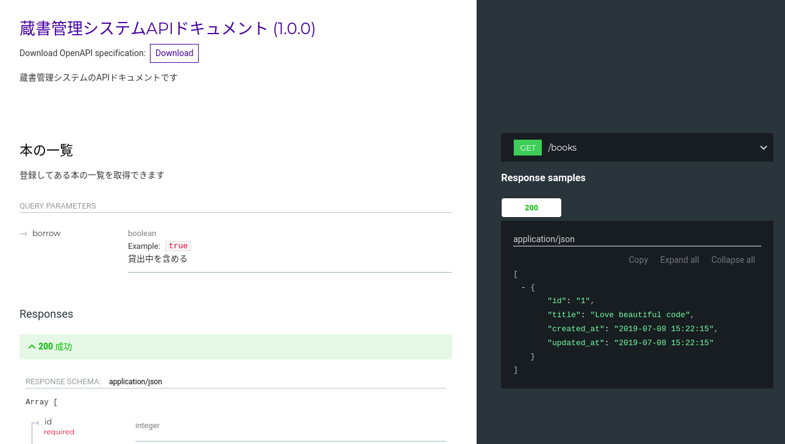
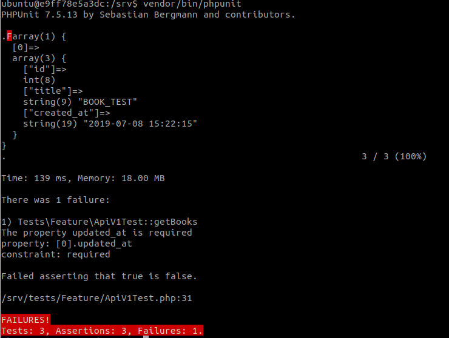
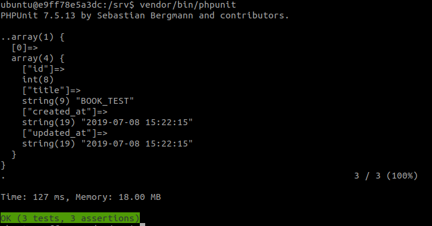

0. [今回話したいこと](#今回話したいこと)
0. [そのために必要なもの](#そのために必要なもの)
0. [実装してみる](#実装してみる)
0. [実際にやってみる（Red）](#実際にやってみる（red）)
0. [最後に](#最後に)

### 今回話したいこと

（API開発チームのひとコマ）

:woman: 「『実装が正、スキーマが追従』って無理だよね」

:man_tone2: 「『スキーマが正、実装が追従』するようにしたいよね」

---
### しましょう

PHPUnitで、APIがスキーマと異なるレスポンスを返したら、落ちるテストを書きましょう :red_circle:

---
### そのために必要なもの

- OpenApi
- redoc-cli
- PHPUnit
- openapi-validator

---
### OpenApi

スキーマを書くための すごい yaml (JSON)。

まぁまぁ覚えることが多い。

https://swagger.io/docs/specification/about/

---
こんな感じ

```yaml:title=apiV1.yml
openapi: 3.0.2
info:
  title: 蔵書管理システムAPIドキュメント
  description: 蔵書管理システムのAPIドキュメントです
  version: 1.0.0
servers:
  - url: https://example.com/api
    description: 本番環境
paths:
  /books:
    get:
      summary: 本の一覧
      description: |
        登録してある本の一覧を取得できます
      operationId: getBooks
      parameters:
        - name: borrow
          in: query
          description: |
            貸出中を含める
          required: false
          schema:
            type: boolean
            example:
      responses:
        200:
          description: 成功
          content:
            application/json:
              schema:
                type: array
                items:
                  $ref: '#/components/schemas/book'
components:
  schemas:
    book:
      title: Book
      description: Bookのスキーマです。
      required:
        - id
        - title
        - created_at
        - updated_at
      type: object
      properties:
        id:
          type: integer
        title:
          type: string
        created_at:
          type: string
        updated_at:
          type: string
      example:
        id: "1"
        title: "Love beautiful code"
```

Q. なんかよくわかんないんだけど…
A. 慣れれば読めるようになります！頑張ってください！！

---
### redoc-cli

さっきのよくわかんない yaml をhtmlにしてくれるやつ

コマンド一発でドキュメントを作ってくれるから便利

`redoc-cli bundle ./resources/docs/apiV1.yml -o ~/book_sample.html`

https://github.com/Redocly/redoc/tree/master/cli

---
こんな感じ


---
### openapi-validator 
OpenApi の yaml をPHPUnitに取りこむやつ 

[イメージ図]

```
response => Validator = (OK) => Green
                      = (NG) => Red
```

https://gitlab.com/mmalawski/openapi-validator

---
### 実装してみる

(Laravelを使う前提)

1. OpenApi でスキーマを書く
2. PHPUnit (openapi-validator) でそのスキーマを呼び出す
3. レスポンスとスキーマが違ってたらRED

---
### 1. OpenApi でスキーマを書く

頑張りましょう！

(ドキュメント見つつ悪戦苦闘するしか無いような気が… :innocent: )

https://swagger.io/docs/specification/about

今回は出来上がったスキーマは `resources/docs/apiV1.yml` に置きます

---
### 2. PHPUnit (openapi-validator) でそのスキーマを呼び出す

こんな感じです

```php:title=apiV1Test.php
<?php

namespace Tests\Feature;

use Tests\TestCase;
use Mmal\OpenapiValidator\Validator;
use Symfony\Component\Yaml\Yaml;


class ApiV1Test extends TestCase
{
    /** @var Validator */
    static $openApiValidator;

    public static function setUpBeforeClass()
    {
        parent::setUpBeforeClass();
        self::$openApiValidator = new Validator(Yaml::parse(file_get_contents(resource_path('docs/apiV1.yml'))));
    }

    /**
     * @test
     */
    public function getBooks()
    {
        $response = $this->get('api/book');
        
        $result = self::$openApiValidator->validate('getBooks', 200, json_decode($response->getContent(), true));
        $this->assertFalse($result->hasErrors(), $result);
    }
}
```

1. テスト前に `$openApiValidator` としてOpenApiを読み込んで
2. テストで「OpenApi上のレスポンスの定義 / 期待するステータスコード /レスポンス」を `$openApiValidator` を渡す
3. Green or Red

---
### 実際にやってみる（Red）

レスポンスから `updated_at` を消してみると…



あるはずのプロパティが無いと怒られる！Red！！

---
### 実際にやってみる（Green）

レスポンスに `updated_at` を追加してみると…



レスポンスとスキーマの定義が同じ！Green！！

---
### テストが全部通った後に

redoc-cli でスキーマを html にして公開！ 

---
### 最後に

何が辛いって、OpenApi(yaml)書くのがとにかく辛いです (^o^)

既存でAPIがあるとなおさらしんどいです (^o^)(^o^)

