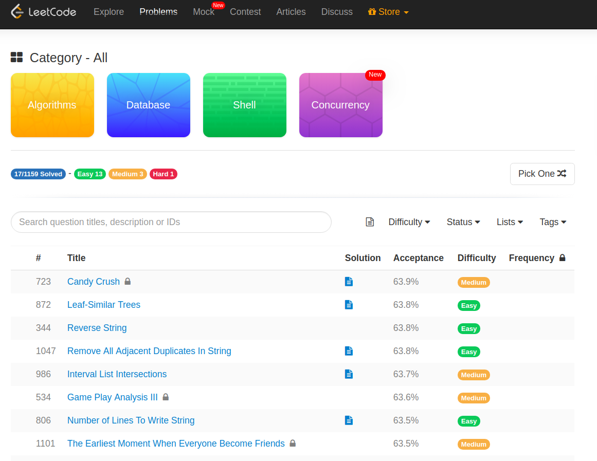
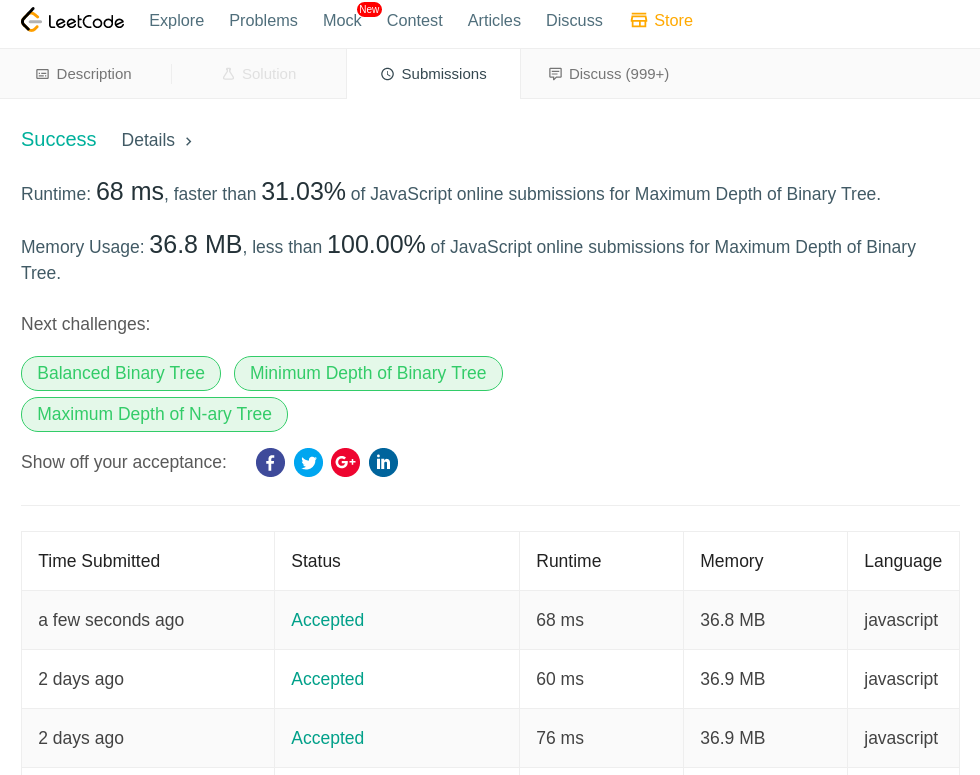

0. [LeetCodeとは](#leetcodeとは)
0. [JavaScriptに関する学び](#javascriptに関する学び)
0. [問題を解くにあたって参考にしたページ](#問題を解くにあたって参考にしたページ)

## LeetCodeとは

技術面談でよく有る（であろう）問題を集めたサイトです。

https://leetcode.com/

例えば「過半数が同じ数である配列について、その過半数を占める数を求める関数を書きなさい」みたいな問題がたくさんあります。

問題の一覧はこんな感じ。

LeetCode の何が良いかと言うと

- 基本無料
- 何回でもリトライできて、結果の正解不正解をパッと教えてくれる
- 正解だった場合「あなたの解答は時間計算量が全体の上位○%、空間計算量が全体の上位○%」と教えてくれる
- 問題だけじゃなくて「バイナリツリーとは何か？」みたいな解説が有る

という点です。

### 基本無料
基本無料です。

なにが有料かと言うと「Top Google Questions」を見たいと思った場合です。

それが「Googleで出題された問題」なのかは定かではありませんが、全体の10%くらいは無料では見れないです。

ただ「アルゴリズムなんて初めて」「コンピュータ・サイエンス？なにそれ知らん」という自分みたいな人は、無料でも終わりが見えないくらい楽しめます。

### 何回でもリトライできて、結果の正解不正解をパッと教えてくれる
### 正解だった場合「あなたの解答は時間計算量が全体の上位○%、空間計算量が全体の上位○%」と教えてくれる

自分の場合だと「うーん、分からんけどとりあえず提出してみるか」みたいにしてるとモチベが下がらなくて良いです。

提出した後の画面はこんな感じ。

結果が「Runtime: xx ms, faster than 90.03%」とか出ると非常に嬉しい。

### 問題だけじゃなくて「バイナリツリーとは何か？」みたいな解説が有る

「そもそもバイナリツリーって何…？」ていうのもカバーしてるが初心者には良い。

内容は親切丁寧って感じでなく「軽く解説＆動画＆簡単な問題」みたいな構成なんだけど、それもガッツリ勉強する気は無い自分にはGOOD!

## JavaScriptに関する学び

以下、将来の自分に向けたメモ
（アルゴリズム系の問題をjavascriptで解きたい奇特な人には参考になるかも？）

- forEach()は基本的に途中で止まらない
  - 普通の `for` もしくは `for ... of` を使うことが多い
- array.操作(element, indes)
  - 引数はこの順番が多い
- `0` は `false`
- array.sort は辞書的な並べ替え
  - 数値でsortしたかったら `array.sort((a,b) => a - b)`
- array.find()は見つからなかったらundefinedを返す

## 問題を解くにあたって参考にしたページ

- https://developer.mozilla.org/ja/docs/Web/JavaScript/Reference
- https://qiita.com/cotrpepe/items/1f4c38cc9d3e3a5f5e9c
- https://www.jabba.cloud/20161020172918/
- https://1kohei1.com/leetcode/
