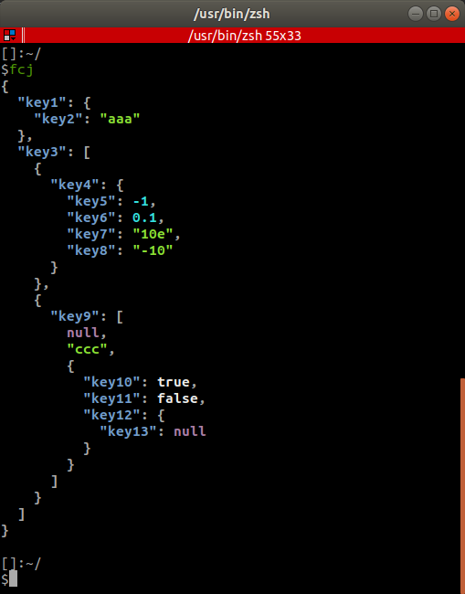
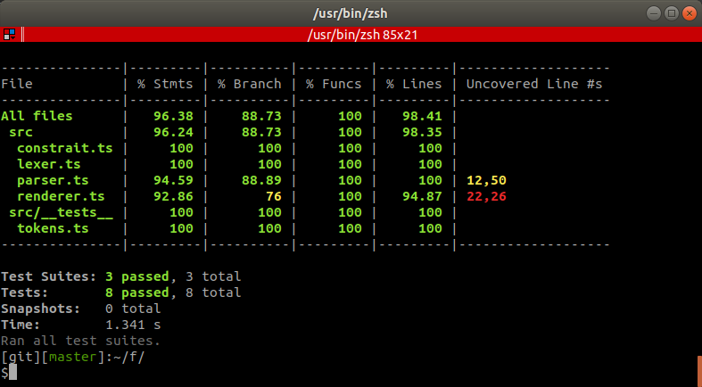

# 作ったもの

クリップボードから Json を読み込んで、こんな風にに表示してくれる `fcj` というコマンドを作りました。



https://github.com/kon-shou/fcj

`npm install -g fcj` でインストールできます。

# 何ができるの？

クリップボードを勝手に読み込んで

- Json が保存されてたら…
    - 整形＆色付きでターミナルに表示
    - `~/.fcj/formatted.Json` に結果を保存
- Json 以外が保存されてたら…
    - デコードしてターミナルに表示
    - `~/.fcj/formatted.text` に結果を保存
    
みたいなことができます。

# どうして作ったの？

<blockquote class="twitter-tweet">
  <p lang="ja" dir="ltr">
    よく色んな人に JSON
    パーサ書くのをオススメしてるけど、書き始めた皆さんだいたい同じ箇所で引っ掛かったり間違えたりするので、その度に「そこです、そこが後から効いてくるんです(僕もそこ間違った)」と心の中で思ってる。
  </p>
  &mdash; mattn (@mattn_jp)
  <a
    href="https://twitter.com/mattn_jp/status/1293542617225900032?ref_src=twsrc%5Etfw"
    >August 12, 2020</a
  >
</blockquote>

このツイートを見て、「息抜きがてらにやってみるか〜」と思ったことがきっかけです。

あとオペとかしてると、ワンラインになってたり、エンコードされてたりする Json に良く遭遇するじゃないですか？

今まで、自分の場合だと

1. Jsonをコピー
2. ターミナルで `{Jsonをペースト} | jq .`
3. 結果をコピーして、別ファイルにペーストして、Intellijで開く。

みたいなフローだったんですが、コピーとペーストがめんどくさいなぁと思ってました。

`fcj` を使うと

1. Jsonをコピー
2. ターミナルで `fcj` と叩く
3. あらかじめ作成しといたシンボリックを intellij で開く

みたいなフローになりました。

逐一、コピー＆ペーストをしなくていいのがちょっと楽。という感じです。

# どんな技術スタックで作ったの？

## 言語
- Typescript

## ビルド
- @zeit/ncc

## テスト
- jest

## Lint
- prettier

## その他必要だったライブラリ
- chalk (出力に色つける)
- strip-ansi (出力から色を消す)
- clipboardy (クリップボードから取得)

みたいな構成で作りました。

ビルドツールの `@zeit/ncc` だけ見慣れないやつだと思うんですが、「こまかいものを作るのに、Webpackで色々と設定とかめんどくさいな…」と思ったので、[今あえてTypeScriptのビルド＆バンドルツールを探してみる](https://future-architect.github.io/articles/20200319/)という記事を参考に、パッと使えそうなやつを選びました。

たぶんWebpackでわちゃわちゃするより楽なはず…？

でもこのくらいの小ささなら、どのみち変わらないような…？？

まぁとにかく `npx ncc run index.ts` で動かしながら開発がやりやすかったから問題なしです。
 
# Json Parser のロジックはどんな感じ？

３時間くらい考えて、まっっったく手も足も出なかったので答えを見ました。

自分が答えに選んだのはこちら。

https://github.com/eatonphil/pj

[ブログ記事](https://notes.eatonphil.com/writing-a-simple-json-parser.html) で解説されてるのを、ホーホー言いながら、Typescriptで書き写しつつ、自分なりに書きやすいように修正した感じです。

一応、自分の実装を解説します。（実装はこちら: https://github.com/kon-shou/fcj ）

下記の Json を 

```json
{"key1":{"key2":"aaa"}}
``` 

下記の Javascript のオブジェクトに変換することを目的とします。

```typescript
{
  "key1": {
    "key2": "aaa"
  }
}
```

その変換のロジックは２つに分けることが出来ます。

1. Jsonをトークンに分解する
2. トークンをプログラミング言語のオブジェクトに変換する

です。 

## 1. Jsonをトークンに分解する

下記の Json を 

```json
{"key1":{"key2":"aaa"}}
``` 

下記のトークンという単位に分解します。

```javascript
[
  '{',   'key1', ':',
  '{',   'key2', ':',
  'aaa', '}',    '}'
]
```

その起点となるのは、下記の `lex()` という関数です。

```typescript:title=lexer.ts
export function lex(text: string): (string | number | boolean | null)[] {
    const tokens = [];

    while (text.length > 0) {
        const lexFunc = determineTextType(text);
        let [token, rest] = lexFunc(text);
        if (token !== undefined) {
            tokens.push(token);
        }
        text = rest;
    }

    return tokens;
}
```

この `lex()` という関数にJsonを渡してやると `determineTextType()` で「Jsonの中で初めにあるトークン」の種類を判別して、そのトークンをJsonから取り出す関数を `lexFunc` に格納します。

`lexFunc` を実行すると、Jsonからトークンを取り出す。そして取り出された後のJsonについて、もう一度、トークンの種類を判別して… というループを実行します。

`determineTextType()` の実装はこんな感じです。

```typescript:title=lexer.ts
function determineTextType(text: string) {
    if (text[0] === JSON_QUOTE) return lexString;
    if (NUMBER_CHARS.includes(text[0])) return lexNumber;
    if (
        (text.length >= TRUE_LEN && text.slice(0, TRUE_LEN) === "true") ||
        (text.length >= FALSE_LEN && text.slice(0, FALSE_LEN) === "false")
    ) {
        return lexBool;
    }
    if (text.length >= NULL_LEN && text.slice(0, NULL_LEN) === "null") {
        return lexNull;
    }
    if (JSON_WHITESPACE.includes(text[0])) return lexWhiteSpace;
    if (JSON_SYNTAX.includes(text[0])) return lexJsonSyntax;

    throw new Error(`Text contains not supported char: ${text[0]}`);
}
```

「文字列の１文字目が `"` か」とか「文字列の４文字目までが `true` か」みたいな条件で、文字列に含まれるトークンを判断します。

そして、判断されたトークンに応じて、適切な関数を返します。

例えばトークンがstringだった場合には、下記の `lexString()` が返ります。

```typescript:title=lexer.ts
function lexString(text: string): [string, string] {
    let jsonString = "";

    text = text.slice(1); // remove first double quote
    for (const char of text) {
        if (char === JSON_QUOTE) {
            return [
                jsonString,
                text.slice(jsonString.length + 1), // remove last double quote
            ];
        }
        jsonString += char;
    }
}
```

この場合には、「文字列の場合には両端は `"` なので、それを削除したうえで、Jsonからトークンを取り出す。」というロジックになります。

## 2. トークンをプログラミング言語のオブジェクトに変換する

`lex()` によって分解された下記のトークンを

```javascript
[
  '{',   'key1', ':',
  '{',   'key2', ':',
  'aaa', '}',    '}'
]
```

下記のjavascriptのオブジェクトに変換します。

```javascript
{
  "key1": {
    "key2": "aaa"
  }
}
```

そのために、下記の `parse()` という関数を実行します。

```typescript:title=parser.ts
export function parse(tokens: tokenArray): [any, tokenArray] {
    if (tokens[0] === JSON_LEFTBRACE) return parseObject(tokens.slice(1));
    if (tokens[0] === JSON_LEFTBRACKET) return parseArray(tokens.slice(1));
    return [tokens[0], tokens.slice(1)];
}
```

「トークンが `{` なら、以降のトークンはオブジェクトの中身のはず、 `[` なら配列の中身のはず。」という前提で、残りのトークンを `parseObject()` / `parseArray()` に渡します。

`parseObject()` の実装は下記のようになります。

```typescript:title=parser.ts
function parseObject(tokens: tokenArray): [{}, tokenArray] {
    const jsonObject = {};
    if (tokens[0] === JSON_RIGHTBRACE) return [jsonObject, tokens.slice(1)];

    while (true) {
        const jsonKey = tokens.shift();
        if (typeof jsonKey !== "string") {
            throw new Error(
                `Expected string key, got: [${typeof jsonKey}] ${jsonKey}`
            );
        }

        const colon = tokens.shift();
        if (colon !== JSON_COLON) {
            throw new Error(
                `Expected colon after key in object, got: ${jsonKey}`
            );
        }

        const [value, rest] = parse(tokens);
        tokens = rest;
        jsonObject[jsonKey] = value;

        const rightBraceOrComma = tokens.shift();
        switch (rightBraceOrComma) {
            case JSON_COMMA:
                // do next loop
                break;
            case JSON_RIGHTBRACE:
                return [jsonObject, tokens];
            default:
                throw new Error(
                    `Expected right brace or colon after node in object, got: ${rightBraceOrComma}`
                );
        }
    }
}
```

「 `}` ならパースを完了して、空のオブジェクトをreturn、 `{` の次のトークンはキーとなるstringのはず、その次は `:` のはず、その後のトークンはJsonとして何でもあり得るので、再帰的に `parse()` を実行」という流れです。

そして `parse()` が終わった後は、「次のトークンは `,` か `}` のはず。 `,` ならもう一度最初からオブジェクトのパースを行い、 `}` なら完了して、パース結果をreturn。」という感じで、トークンのパースが終わります。

これをトークンが `[` で始まった場合では `parseArray()` で同様にパースを実行し、結果Javascriptのオブジェクトができあがるという訳です。

# Json Parser のロジックをカンニングして実装した感想

出来上がったものについて、あーだこーだ言うことはできるのですが、０からハイ作って！と言われると難しいですね…！

いつか０からバーっと書けるように、この手の構文解析（？）的なやつをコツコツやっていこうと思います。

# （おまけ）テストについて

初めてカバレッジに触れたのですが、これ良いですね。



ザーッとテスト書いて、カバレッジ足りない所を足したり、カバレッジ足りてるのに再度テストしてるのを消したり、テスト書いててで割と辛い「テストケースに網羅性をもたせる」というのがやりやすくなりました。　

ただ「カバレッジ100%を目指すと辛い」というのも実感しましたね…。

というのも、今回だと Json Parser 以外のファイル保存周りをテストしようしたら、「fsモジュールのモック」とか「自分で作ったモジュールでexportされてないsave系のメソッドをモック」をしなくちゃいけなかったりで、大変でした。

大変さの割に、確認できることは「fs モジュールがただしく動作すること」だったりで、「なるほど、これが噂の100%を目指すと辛いというやつか…」と思いました。

ただその辛さも全体の5%くらいで、95%くらいはメリットの方が上回りそう。

副作用が絡むような難しいところは無視しつつ「テストし忘れのロジック」を発見するためにカバレッジを利用するのが良いんでしょうね。

